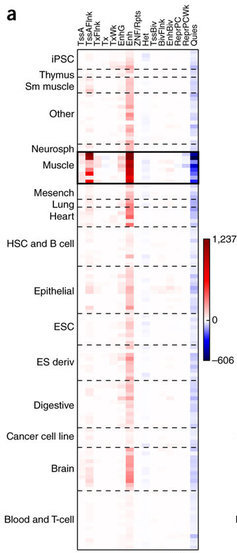

# Data integration

In the last part of the tutorial, we are going to go through some ways in which you can investigate the impact of DNA methylation.
The examples that we outline here are just some of the examples that you can use as figures in your paper.

## Data prep

Firstly, we need to prepare our files to only include the first 3 columnes (chromosome, chromosome start and chromosome end) in the bedGraph file (i.e. creating a `bed3` file).
This is required for the `cpgtools`.
We need to first remove the "track" line (i.e. the first line) and exract columns 1, 2 and 3.

    $ grep -v "track" SRR534177_colWT_trimmed_bismark_bt2.deduplicated.sorted_CpG.bedGraph | \
        cut -f1-3 > SRR534177_colWT_trimmed_bismark_bt2.deduplicated.sorted_CpG.bed

Lets create a loop on the command-line to do this on all files:

    $ for i in *.bedGraph; do 
        grep -v "track" $i | cut -f1-3 > `basename $i .bedGraph`.bed
      done

As an example, we will only be running CpG bed files, so try all the other contexts as well

## Extracting CpG sites overlapping gene intervals

With CpG sites found in both samples, we now want to see what genes that find what genes that these sites overlap with.
To do this, we're going to use the TAIR10 gene bedfile (converted from GFF3 annotation file) and the [`bedtools` suit of tools](https://bedtools.readthedocs.io/en/latest/index.html).
To intersect the CpG sites with gene intervals, we'll use `bedtools intersect`

Lets intersect our bed file with the TAIR10 genes and extract the CpG columns from the first file (chromosome, chromosome start and chromosome end) and the gene name from the second file (7th column of the output)

    $ bedtools intersect -a SRR534177_colWT_trimmed_bismark_bt2.deduplicated.sorted_CpG.bed \
        -b TAIR10_genes.bed -wo | cut -f1,2,3,7

    $ bedtools intersect -a SRR534239_met1_trimmed_bismark_bt2.deduplicated.sorted_CpG.bed \
        -b TAIR10_genes.bed -wo | cut -f1,2,3,7

You can actually extract this information with `cpgtools` using the CpG_to_gene.py command.
This command takes a bed file (3 column) input and gene-associated bed file to determine sites which overlap.

    $ CpG_to_gene.py -i SRR534239_met1_trimmed_bismark_bt2.deduplicated.sorted_CpG.bed \
        -r TAIR10_genes.bed -o output

    $ head -n 20 output.associated_genes.txt
    #The last column contains genes whose extended regulatory domain are overlapped with the CpG
    #The 2nd last column contains genes whose basal regulatory domain are overlapped with the CpG
    #"//" indicates no genes are found
    1	4107	4108	AT1G01010	//
    1	5458	5459	//	AT1G01020
    1	8642	8643	AT1G01020	//
    1	8658	8659	AT1G01020	//
    1	8661	8662	AT1G01020	//
    1	12227	12228	AT1G01020	//
    1	12302	12303	AT1G01020	//
    1	12394	12395	AT1G01020	//
    1	12726	12727	AT1G01030;AT1G01020	//
    1	16759	16760	AT1G01030	//
    1	19212	19213	AT1G01040	//
    1	23296	23297	AT1G01040	//
    1	23844	23845	AT1G01040;AT1G01046	//
    1	24187	24188	AT1G01046	//
    1	24189	24190	AT1G01046	//
    1	24195	24196	AT1G01046	//
    1	24235	24236	AT1G01046	//

`cpgtools` define these regulatory domains as:

"Basal regulatory domain is a user-defined genomic region around the TSS (transcription start site). By default, from TSS upstream 5 Kb to TSS downstream 1 Kb is considered as the gene’s basal regulatory domain. When defining a gene’s basal regulatory domain, the other nearby genes are ignored (which means different genes’ basal regulatory domain can be overlapped.)

Extended regulatory domain is a genomic region that is further extended from basal regulatory domain in both directions to the nearest gene’s basal regulatory domain but no more than the maximum extension (specified by ‘-e’, default - 1000 kb) in one direction. In other words, the “extension” stops when it reaches other genes’ “basal regulatory domain” or the extension limit, whichever comes first."

## Methylation sites across a chromosome

Lets now have a look at how methylation sites are distributed over the two chromosomes we analysed, chromosome 1 and the chloroplast.
These plots are a great way to compare two regions.
This `cpgtools` command takes the CpG bed file, sample name and the total sequence length of each chromosome.

    $ CpG_distrb_chrom.py -i SRR534177_colWT_trimmed_bismark_bt2.deduplicated.sorted_CpG.bed \
        -n colWT -s TAIR.chrom.sizes -o chromDist

This produces a number of figures, each that displaye slightly different metrics:

    $ ls -l chromDist*
    chromDist.CpG_perMb.pdf
    chromDist.CpG_percent.pdf
    chromDist.CpG_total.pdf

## Methylation sites across a gene regions

Perhaps one of the most common plots seen in DNA methylation studies is the [centred gene methylation plot](https://cpgtools.readthedocs.io/en/latest/demo/CpG_density_gene_centered.html), where the density of methylation sites are compared to the body of the gene and upstream/downstream regions. 
Again, here we use a `cpgtools` command takes the gene coordinates and CpG bed file to produce the density plot.

    CpG_density_gene_centered.py -r TAIR10_genes.bed \
        -i SRR534177_colWT_trimmed_bismark_bt2.deduplicated.sorted_CpG.bed \
        -o CpG_density

Be aware, this is density of sites (count) rather than methylation level.

## Other example plots

- Circos plots

- GIGGLE and Epigenomics Roadmap

- Density scatter plots

- Boxplots

